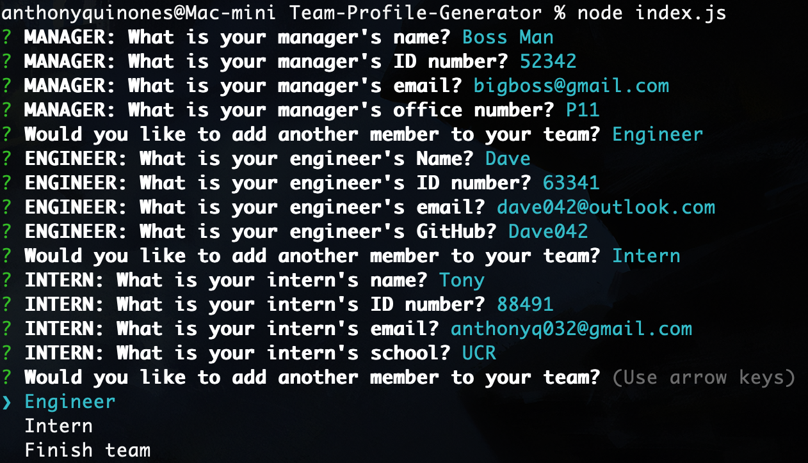
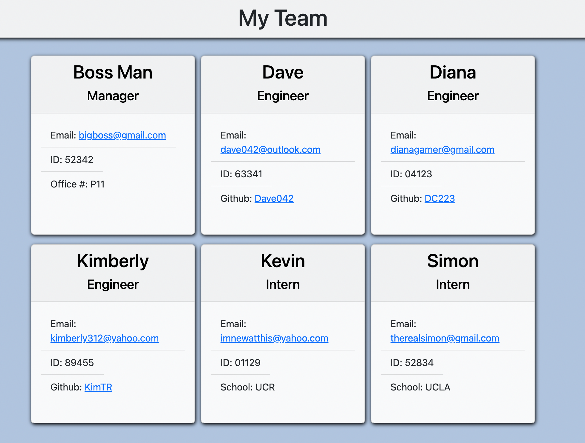

# Team-Profile-Generator
A Node.js command-line application that takes employee information and generates an HTML webpage that displays summaries for each person.

## Description
The purpose of this project was to create a command-line application using Node.js, Inquirer, Jest, and classes that automatically generate a website with the user's data. The command line asks the user a series of questions in order to build their team. The user starts off creating a `Manager` but can then create as many `Engineers` and `Interns` as they want for their team. 

This project also demonstrates unit testing for the various employee classes. These tests ensure that the code is running as intended. They can be found within the `__tests__` folder.

## Table of Contents
* [Installation](#installation)
* [Usage](#usage)
* [Licenses](#licenses)
* [Tests](#tests)
* [Demonstration](#demonstration)
* [Questions](#questions)

## Installation
The project can be run by adhering to the following steps:
1. Install Node.js.
3. Navigate to the root of the repo using terminal/gitbash.
4. Install the Inquirer npm by running `npm i inquirer@8.2.4`.
5. Run `node index.js` to begin the program.

The tests can be run by adhering to the following steps:
1. Navigate to the root of the repo.
2. Enter `npm install --save-dev jest` into your terminal/gitbash.
3. Navigate to the `__tests__` folder.
4. Run `npm run test` to begin the tests.

## Usage
If properly installed, the user should be first prompted with four questions about creating a team `manager`. The user will then be given the option of adding an `engineer`, an `intern`, or finishing the team. If the user selects either `engineer` or `intern`, then the user will be asked various questions about the new team member. At the end of the questions, the user is then asked again if they would like to add a new team member. The user can add as many team members as they like. When they are satisfied with their team, they can select `'finish team'` to generate their new website.

A new html file called `index.html` will be generated within the `dist` folder upon completion of the program. The user can then open the file to view their new page. Users can click on their Github names to open a separate tab of their GitHub page. They can also click on their emails to automatically open their default email app with the corresponding email already filled in for them.

## Licenses
This project falls under the following license(s): 

* Public Domain (No license)

## Tests
As previously mentioned, the tests can be run by adhering to the following steps:
1. Navigate to the root of the repo.
2. Enter `npm install --save-dev jest` into your terminal/gitbash.
3. Navigate to the `__tests__` folder.
4. Run `npm run test` to begin the tests.

These tests demonstrate that the `Employee`, `Engineer`, `Manager`, and `Intern` classes and files are all working properly. This is important because they are integral to the successful HTML generation of the page.

## Demonstration
Below is a screenshot of the program running inside a MacOS Terminal.

Screenshot of an example team page generated by the application.

A video demonstration of the program being run is also available [here.](https://drive.google.com/file/d/1PmpF7zuz5hVbYJSNH9WWreoU6MomTxgD/view)

## Questions
If you have any questions, please contact me below: 

Github: [TonyQ032](https://github.com/TonyQ032) 

Email: AnthonyQ032@gmail.com
